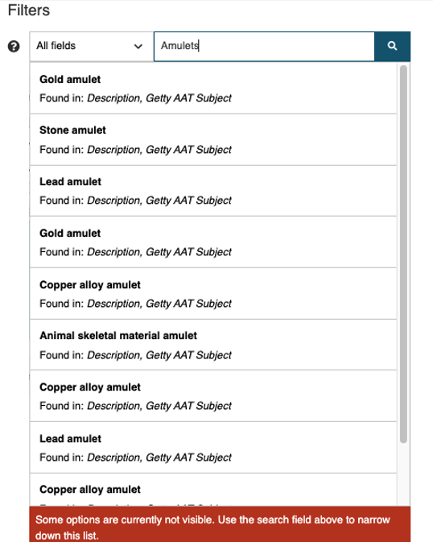
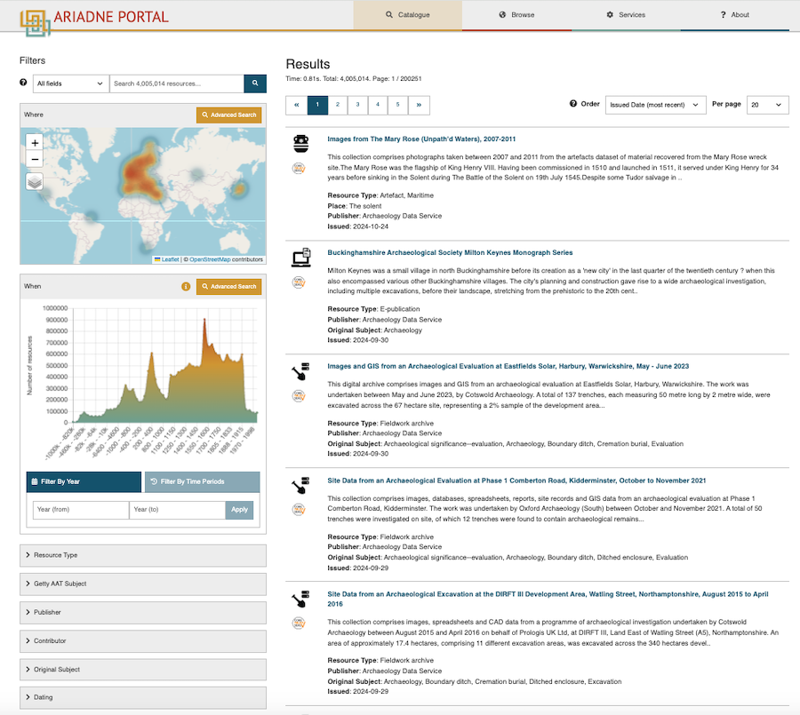
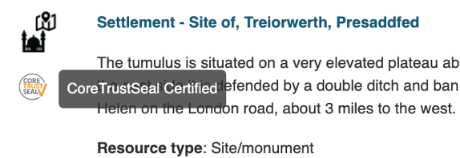
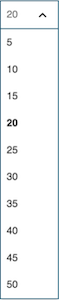
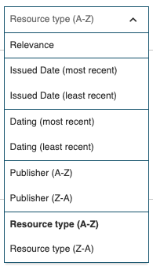

{ width="850" }

# Basic concepts
The ARIADNE Catalogue is based on the concepts of **Open Linked Data, standardised vocabularies** and a **metadata schema** that covers all aspects of archaeology and that other commonly used schemas can be easily mapped to.  The Catalogue only contains metadata (or information about the resources), not the actual resource so that the original owner or publisher has full control over their archaeological data. However, the metadata can be very detailed and can include thumbnail images, for example, as well as a link to the actual digital resource (or in a few cases, the shelf number reference to the physical (printed) resource).

Each record in the Catalogue is a description of an archaeological resource and contains a number of mandatory fields as well as several optional ones. This structure of the description is a metadata schema, the AOCat, based upon the international [CIDOC CRM](https://cidoc-crm.org/) schema which enables relationships to be described and provides formal definitions for cultural heritage information. It is also quite flexible and so, along with specialised vocabularies, can adapt to different terminologies and concepts used by the many different archaeological domains of interest. ARIADNE has developed some of these specialised vocabularies to cover the few domains where the general archaeological terms do not adequately describe the resources, these generally being for more recently defined specialisms such as remote and near-surface sensing data and ancient DNA. 

The mandatory fields that must be provided for each metadata record include the title, a description, a resource type and classification, the time period that applies to the resource and a geographical location. These are necessary for the underlying  “What”, “When” and “Where” design of the Catalogue. Other mandatory information will include the publisher, the URL (or DOI) for the original resource information (located on the publisher’s server) plus any  information which can be extracted from the supplied information such as the country of the resource. Most records belong to collections, so this relationship is also recorded in the metadata. 

Each resource owner may have their own classification system – the terminology can vary widely and can also be in the native language. To ensure that the classification in the ARIADNE Catalogue is uniform and also hierarchical, the [Getty Arts and Architecture Thesaurus](https://www.getty.edu/research/tools/vocabularies/aat/) (Getty AAT) is used to provide the descriptive terms for each resource which allows for efficient and accurate search results. For example, the term “brooches” belongs to a hierarchy which includes “Pins (jewelry)” , “Jewelry” and “Costume accessories” above it and has four sub-categories for different types of brooches – disc, penannular, plaque and ring. Any search will automatically include all records which contain any sub-categories of the specified term. The Getty AAT may also provide more precise categories than the original subject classification and is available in several languages.

The geographical location for each resource is recorded as longitude and latitude using the WGS 84 standard. Where the location of a resource is sensitive (e.g. where a valuable artefact has been found or a marine wreck site), the location may be recorded as an area where the actual location is a random point within the boundaries.

The time period is a little more complicated since a time period can be indicated by a start and end date or a named period such as “Iron Age” or “Medieval”, the issue here being that named periods vary date wise from country to country. The solution is to use [PeriodO](https://perio.do/en/), a gazetteer of time periods widely used by historians and archaeologists which maps named periods to date ranges across the world, making it possible to search for “Bronze Age” across multiple regions, despite the start and end dates varying geographically. 

Finally, each record with the Catalogue is linked to other records through the concept of Linked Open Data. [Linked Data](https://www.w3.org/wiki/LinkedData) is a set of four design principles that means that data is machine-readable and can be inter-linked over the Web. Linked Open Data is where that data can also be freely used and redistributed as in the ARIADNE Catalogue. In order to make this possible, ARIADNE uses technologies such as RDF triple stores (via GraphDB) which creates a map (graph) of each data record and its connections. As more records are added to the Catalogue, the graph is updated. If a change is made to the AOCat metadata schema, which rarely happens but it usually when a new field is added, then the complete graph is regenerated for the whole Catalogue and this is referred to the ARIADNE Knowledge Graph. When a search is performed, this is done by using a SPARQL query on the Knowledge Graph – which is a lot faster and much more efficient than processing millions of database records. Another advantage of this approach is that anyone with the right technical knowledge can access and perform their own searches on the Knowledge Graph via the [ARIADNEplus Lab](https://ariadne.d4science.org/web/ariadneplus_lab/). 

# Using the ARIADNE Catalogue

The ARIADNE Portal contains a Catalogue and several services which provide access to over 4 million archaeological resources that can be searched and filtered according to a number of criteria. The returned results from the search facilities provided with the Catalogue are listed individually as well as aggregated results on the map and on the timeline. This Guide aims at helping all end users to get the maximum benefit from using the Catalogue.

A separate section of the Portal provides several services and tools to assist archaeologists with their research, from planning data management, exploration and analysis to display of all types of data (including from the ARIADNE Knowledgebase, where applicable). Each of these services has its own information on their use and application, so are not covered by this Guide.

For further information about the ARIADNE Research Infrastructure and the Portal, see the [**? About**](https://portal.ariadne-infrastructure.eu/about) page, the link being located in the horizontal menu on the far right at the top.

### Video: demonstration of the Portal Catalogue
This [**40 minute video**](https://www.ariadne-research-infrastructure.eu/catalogue-demonstration-video/) by Prof. Julian Richards provides the background to the development of the Portal, the technology used and demonstrates the search options available in the Catalogue, explaining how these affect the search results. Shorter clips from this video are used in the relevant sections of the Guide.

## How to use this Guide
This Guide has been created in GitHub as part of the documentation associated with the ARIADNE RI AISBL. It is presented in six sections as shown on the left hand side. The contents (headings and sub-headings) within the currently displayed section are shown as links on the right hand side of the page enabling navigation to the required topic of interest. 

## Searching the Catalogue
Entry to the catalogue (i.e. the landing page) consists of a text entry search box with the option to apply one of four filters. 

{ width="850" }

<i>Catalogue entry page</i>

The search is designed to start with one or more key words where logical “AND” is applied. For example, a search for “gold coin” will return only records where both these words, either adjacent or separately, are to be found in the metadata record. The default setting is “All fields”, i.e. the whole record is searched for matching terms. Omitting a key word defaults to the entire Catalogue, the returned results depending on the filters selected.

When a search term is entered, a list of up to 10 records is displayed where the term is found in one or more of the metadata fields. Records with matches in the highest number of fields are shown first. 

<i>List of records matching the search term</i>

### Text-based search
There are four filters based on the metadata supplied for each resource available for more targeted searches:

- **Time period** – name of time period(s) e.g. Iron age, medieval…
- **Place** – place name which can be anything from a specific location to a continent.
- **Title** – only the title fields are searched for matching terms.
- **Getty AAT Subject** – the subject(s) defined by the data provider are matched to the Getty Arts and Architecture Thesaurus which enables the end user to see and search for data with matching translations and also related terms.

For the **Time Period, Place** and **Title** filters, only exact matches in the language used are returned. E.g. if **Time Period** is selected, the Swedish term for Bronze Age, “bronsålder”, will return all records with the text “bronsålder” in the Dating field.

The **Getty AAT Subject** option enables a multi-lingual search to be performed by returning all records that contain a native language match (in the **Original subject** field) to the English **Getty AAT subject** as well as that specified in the **Getty AAT Subject** field when this is present. Furthermore, since the search is hierarchical, any broad term such as “weapons” will also include all sub-categories such as swords, axes, daggers, etc. The search will return records that contain these subjects as well as those with matching terms in other languages.

[**More about the Getty ATT (on the Getty website)**](https://www.getty.edu/research/tools/vocabularies/aat/about.html)

## The Search results page
The search results are displayed with a wider range of filters which can be used to further refine the results. New searches can also be started from this page. 

{ width="850" }

<i>Search results page</i>

Each of the records shown in the search results has a **Resource Type** icon next to its title.
If a resource such as a Collection or a Fieldwork archive, for example, contains more than one Resource type, then the icon will be displayed for first Resource type listed in the metadata (regardless of the actual one selected if the Resource Type filter is used). This is evident for the Resource type ‘Scientific analysis’ as these datasets may be part of a larger collection or Fieldwork archive.

Resources that are to be found in a **CoreTrustSeal certified repository** will also have this icon displayed below the Resource Type icon.

<i>Record of Resource type Site/Monument with the CoreTrustSeal icon (and text displayed with mouseover)</i>

## Options for displaying the results
At the top on the right hand side of the Results page are two options for controlling the display of the results, **Order** and **Per page**.

| Per page |  |
| ------------- | ----------- |
|  | The default number of resources shown on the Results page is 20.   The **Per page** option enables this to be changed from between 5 to 50 per page. |

| Order |  |
| ------------- | ----------- |
|  | **Relevance** - calculated from several fields, Title being the most important, then Description and Subject.  **Issued date** - date of publication of the resource. This is also the default setting.  **Dating** - most recent or least recent date of the one or more dates found in each record.  **Publisher** - data provider (of the resource metadata).  **Resource type** - broad resource type (as defined in the Filters).|

### How ‘Relevance’ is calculated

**Relevance** is basically a score allocated to resources which match the current search criteria based on the metadata fields. This score determines the order in which the resources are listed (i.e. from highest score to lowest or vice versa). The algorithm used gives the highest score to matches to the Title, followed by the Description and then the Subject fields (i.e. nativeSubject and derivedSubject) after that with other fields such as location and time etc. also adding to the score (as and where relevant). 

## Refining the search results
The search results can refined using a combination of **What, Where** and **When** as well as the individual filters. The following sections explain how each of these can be used to narrow down the search results.
