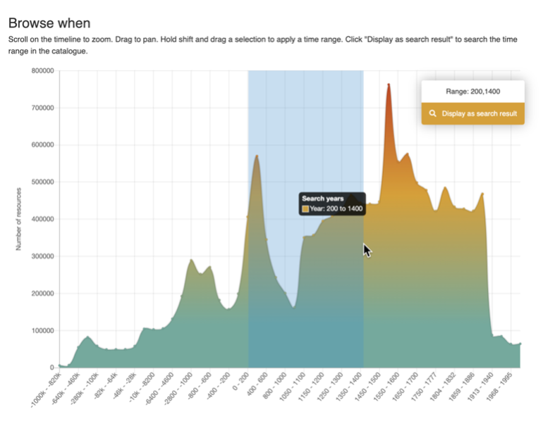
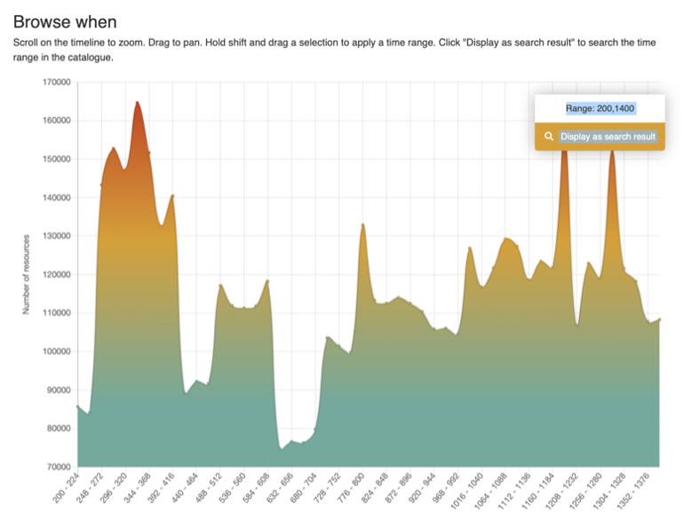
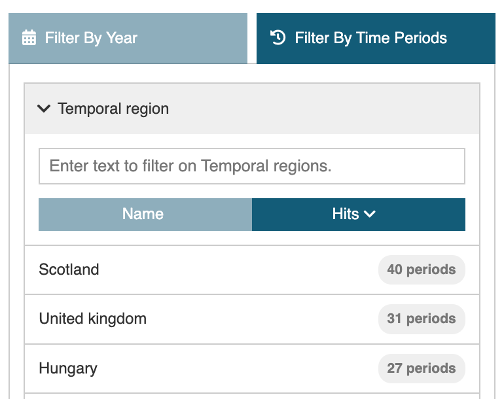
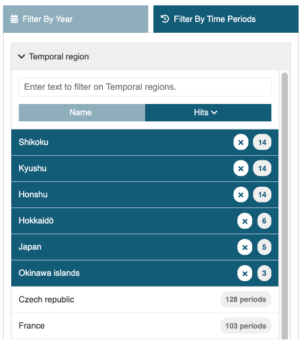
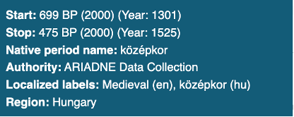

{ width="850" }

# Time period (When)

The When tool consists of three different ways of selecting a time period of interest: a graphic where the mouse is used to select the date range, a text entry box where the start and end year can be specified and a separate filter that uses named time periods as defined in PeriodO.

## The Time line

The Time Period graphic (the time line) displays the resources returned in the search results by date distribution.

The search results can be refined by Clicking on ‘Advanced Search’ to display the Time period filter page (Browse when). 
If no search term is used or the filter is accessed via the ‘Browse when’ option, then the graph shows the date distribution for the entire catalogue.

| The Time line | Description |
| ----------- | ----------- |
|  | The Time Period graphic (the time line) displays the resources returned in the search results by date distribution.

The search results can be refined by Clicking on ‘Advanced Search’ to display the Time period filter page (Browse when). 
If no search term is used or the filter is accessed via the ‘Browse when’ option, then the graph shows the date distribution for the entire catalogue. |
|  | Using the mouse with the Shift key directly on the graphic can be used to define a shorter time period -200-1400 C.E. in this case.

Scrolling with the mouse will cause the time period graphic to expand. 
If the mouse is placed closer to the left side, the x-axis will ‘stretch’ from the left (reducing the end date), placed to the right the start date increases (‘stretch’ from the right).|
|  | Each time the time period graphic is changed, the range updates to show the selected time span. The distribution of the resources by date is recalculated, shown in greater detail as the period range reduces.

Clicking on ‘Display as search result’ returns to the Search Results page with the refined record set. |

## Filter by Year 

An alternative method for selecting a time period is to enter the start and end years in the text box below the graph. 

In both methods, (graph and direct year entry), all records that specify a time period that either falls within and/or overlaps the specified time period will be returned in the results – as shown in the following illustration.

<i>How the time period filter works with the start and end dates specified for each resource</i>

## Filter by Time Periods

The third option enables filtering of the results by named time periods as defined in PeriodO. There are two stages for this filter: Temporal region and Cultural period. The Cultural period can be used standalone or in conjunction with the Temporal region. These work as follows.

### Temporal region

| Filter by Time periods | Description |
| ----------- | ----------- |
|  | This option is used to select one or more (mostly modern day) regions of interest. The majority are at the country level, although Japan is also represented by regions such as Shikoku, Kyushu and Honshu and there are also some larger (historical) areas such as the Byzantium Empire.

Next to each of the region names is the number of defined periods in PeriodO. |

Clicking on the Temporal region box will display the first 20 regions in order of the highest number of defined periods onwards. Alternatively, the text input box (Enter text to filter on Temporal regions.) which is displayed above the list can be used to find a region – all matching options are shown as each letter is input. One or more regions can be selected from the list. 

| Temporal region | Description |
| ----------- | ----------- |
|  | Each selected region automatically moves up to the top part of the list. Regions can be removed and added as required. 
Once selection of the regions is completed, click on the Cultural period Option to display the list of periods associated with each region. These are listed in date order, starting with the earliest start date. 
Note that the time period graph, map or results page do not update as the filter is not complete until one or more Cultural periods have been applied. |

### Cultural period

| Cultural period | Description |
| ----------- | ----------- |
|   |<i>Cultural periods</i> displays all the named periods in date order (from earliest start date) along with the number of hits (matching resources). For each named period, the matching territory is indicated (with ISO 3 letter country code, if available) along with the start year, the number of resources and a Help icon. 
Once both at least one <i>Temporal region</i> and one<i>Cultural period</i> have been selected, the Results page is updated along with the Time line. The map is also disabled for use as an additional filter. |
|  | Using mouseover on the Help icon reveals further information about the period (Medieval (HUN) in this case). |

The Cultural period box will display up to the first 20 periods, more, where these exist, can be shown by clicking on the Get 20 more results... option at the bottom of the list . Alternatively, the text input box (Enter text to filter on Cultural periods.) which is displayed above the list can be used to find periods – all matching options are shown as each letter is input.

The Cultural period filter can also be used independently of the Temporal region, especially when a specific period is of interest (regardless of different start and end dates according to region). For example, entering ‘Roman’ in the Cultural period text box will result in several matches from countries across Europe. 

