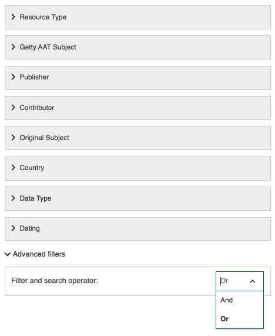
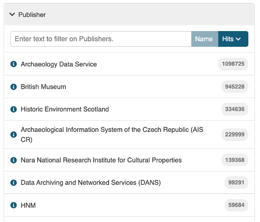
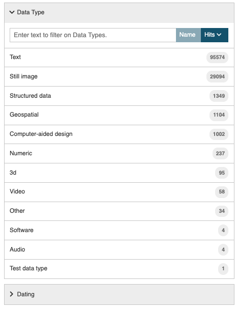
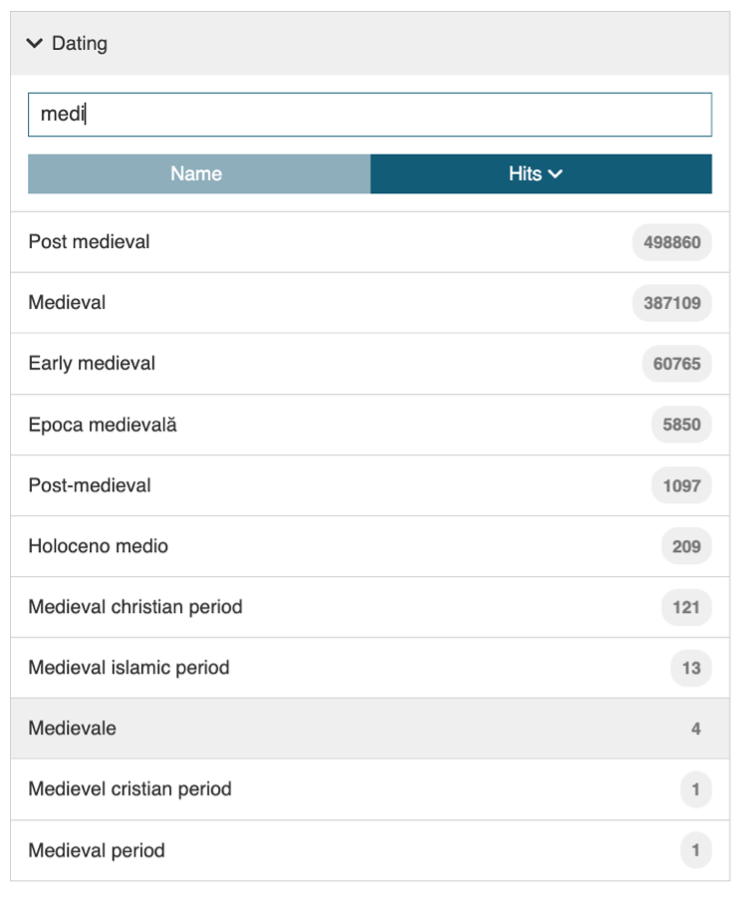

{ width="850" }

# Basic concepts
The ARIADNE Catalogue is based on the concepts of **Open Linked Data, standardised vocabularies** and a **metadata schema** that covers all aspects of archaeology and that other commonly used schemas can be easily mapped to.  The Catalogue only contains metadata (or information about the resources), not the actual resource so that the original owner or publisher has full control over their archaeological data. However, the metadata can be very detailed and can include thumbnail images, for example, as well as a link to the actual digital resource (or in a few cases, the shelf number reference to the physical (printed) resource).

Each record in the Catalogue is a description of an archaeological resource and contains a number of mandatory fields as well as several optional ones. This structure of the description is a metadata schema, the AOCat, based upon the international [CIDOC CRM](https://cidoc-crm.org/) schema which enables relationships to be described and provides formal definitions for cultural heritage information. It is also quite flexible and so, along with specialised vocabularies, can adapt to different terminologies and concepts used by the many different archaeological domains of interest. ARIADNE has developed some of these specialised vocabularies to cover the few domains where the general archaeological terms do not adequately describe the resources, these generally being for more recently defined specialisms such as remote and near-surface sensing data and ancient DNA. 

The mandatory fields that must be provided for each metadata record include the title, a description, a resource type and classification, the time period that applies to the resource and a geographical location. These are necessary for the underlying  “What”, “When” and “Where” design of the Catalogue. Other mandatory information will include the publisher, the URL (or DOI) for the original resource information (located on the publisher’s server) plus any  information which can be extracted from the supplied information such as the country of the resource. Most records belong to collections, so this relationship is also recorded in the metadata. 

Each resource owner may have their own classification system – the terminology can vary widely and can also be in the native language. To ensure that the classification in the ARIADNE Catalogue is uniform and also hierarchical, the [Getty Arts and Architecture Thesaurus](https://www.getty.edu/research/tools/vocabularies/aat/) (Getty AAT) is used to provide the descriptive terms for each resource which allows for efficient and accurate search results. For example, the term “brooches” belongs to a hierarchy which includes “Pins (jewelry)” , “Jewelry” and “Costume accessories” above it and has four sub-categories for different types of brooches – disc, penannular, plaque and ring. Any search will automatically include all records which contain any sub-categories of the specified term. The Getty AAT may also provide more precise categories than the original subject classification and is available in several languages.

The geographical location for each resource is recorded as longitude and latitude using the WGS 84 standard. Where the location of a resource is sensitive (e.g. where a valuable artefact has been found or a marine wreck site), the location may be recorded as an area where the actual location is a random point within the boundaries.

The time period is a little more complicated since a time period can be indicated by a start and end date or a named period such as “Iron Age” or “Medieval”, the issue here being that named periods vary date wise from country to country. The solution is to use [PeriodO](https://perio.do/en/), a gazetteer of time periods widely used by historians and archaeologists which maps named periods to date ranges across the world, making it possible to search for “Bronze Age” across multiple regions, despite the start and end dates varying geographically. 

Finally, each record with the Catalogue is linked to other records through the concept of Linked Open Data. [Linked Data](https://www.w3.org/wiki/LinkedData) is a set of four design principles that means that data is machine-readable and can be inter-linked over the Web. Linked Open Data is where that data can also be freely used and redistributed as in the ARIADNE Catalogue. In order to make this possible, ARIADNE uses technologies such as RDF triple stores (via GraphDB) which creates a map (graph) of each data record and its connections. As more records are added to the Catalogue, the graph is updated. If a change is made to the AOCat metadata schema, which rarely happens but it usually when a new field is added, then the complete graph is regenerated for the whole Catalogue and this is referred to the ARIADNE Knowledge Graph. When a search is performed, this is done by using a SPARQL query on the Knowledge Graph – which is a lot faster and much more efficient than processing millions of database records. Another advantage of this approach is that anyone with the right technical knowledge can access and perform their own searches on the Knowledge Graph via the [ARIADNEplus Lab](https://ariadne.d4science.org/web/ariadneplus_lab/). 

# Search Filters

In addition to the What, Where and When tools, there are several filters that each operate on a specific field in the metadata that can be used to refine the returned search results. There are also the Advanced filters, the And and Or operators which can be applied to the selected filters.

 

The search results will automatically populate the filters with all the matching terms from the records found. For the Resource Type, Publisher and Country, the number of term matches will be the same as the number of records. For the Getty AAT subject, Original subject and Dating, the number of matching terms in these filters will exceed the total number of records since these will also include all the other terms found in these fields. 
Using the ‘Clear All Filters’ option (just below the text entry box) will revert the search results to the whole Catalogue, populating the filters will all the possible matching terms.

## Text entry
The text entry looks for matching terms in key metadata fields so the returned results may be quite large in number and varied in subject matter, requiring further refinement.

| What | Description |
| ------------- | ----------- |
| &nbsp;&nbsp;&nbsp;&nbsp;&nbsp;&nbsp;&nbsp;&nbsp;&nbsp;&nbsp;&nbsp;&nbsp;&nbsp;&nbsp;&nbsp;&nbsp;&nbsp;&nbsp;&nbsp;&nbsp;&nbsp;&nbsp;&nbsp;&nbsp;&nbsp;&nbsp;&nbsp;&nbsp;&nbsp;&nbsp;&nbsp;&nbsp;&nbsp;&nbsp;&nbsp;&nbsp;&nbsp;&nbsp;&nbsp;&nbsp;&nbsp;&nbsp;&nbsp;&nbsp;&nbsp;&nbsp;&nbsp;&nbsp;&nbsp;&nbsp;&nbsp;&nbsp;&nbsp;&nbsp;&nbsp;&nbsp;&nbsp;&nbsp;&nbsp;&nbsp;&nbsp;&nbsp;&nbsp;&nbsp;&nbsp;&nbsp;&nbsp;&nbsp;&nbsp;&nbsp;&nbsp;&nbsp;&nbsp;&nbsp;&nbsp;  | The search text entry box is immediately below 'Filters' in the top left hand corner of the page.    The first set of filters located in the drop-down menu are a repeat of the filters found on the Catalogue entry page. |

## Resource Type

The Resource type is an ARIADNE concept designed to categorise the resources into general areas of interest to archaeologists and the names are mostly self-explanatory. 

| Resource Type | Description |
| ----------- | ----------- |
| &nbsp;&nbsp;&nbsp;&nbsp;&nbsp;&nbsp;&nbsp;&nbsp;&nbsp;&nbsp;&nbsp;&nbsp;&nbsp;&nbsp;&nbsp;&nbsp;&nbsp;&nbsp;&nbsp;&nbsp;&nbsp;&nbsp;&nbsp;&nbsp;&nbsp;&nbsp;&nbsp;&nbsp;&nbsp;&nbsp;&nbsp;&nbsp;&nbsp;&nbsp;&nbsp;&nbsp;&nbsp;&nbsp;&nbsp;&nbsp;&nbsp;&nbsp;&nbsp;&nbsp;&nbsp;&nbsp;&nbsp;&nbsp;&nbsp;&nbsp;&nbsp;&nbsp;&nbsp;&nbsp;&nbsp;&nbsp;&nbsp;&nbsp;&nbsp;&nbsp;&nbsp;&nbsp;&nbsp;&nbsp;&nbsp;&nbsp;&nbsp;&nbsp;&nbsp;&nbsp;&nbsp;&nbsp;&nbsp;&nbsp;&nbsp;&nbsp;&nbsp;&nbsp;&nbsp;&nbsp;&nbsp;&nbsp;&nbsp;&nbsp;&nbsp;&nbsp;&nbsp;&nbsp;&nbsp;&nbsp;&nbsp;&nbsp;&nbsp;&nbsp;&nbsp;&nbsp;&nbsp;&nbsp;&nbsp;&nbsp;&nbsp;&nbsp;&nbsp;&nbsp;&nbsp;&nbsp;&nbsp;&nbsp;&nbsp;&nbsp;&nbsp;&nbsp;&nbsp;&nbsp;&nbsp;&nbsp;&nbsp;&nbsp;&nbsp;&nbsp;&nbsp;  | Those Resource types that may need clarification are:   **Fieldwork** – normally a record relating to specific fieldwork e.g. evaluations, interventions, etc.   **Fieldwork report** – these always have a link (URL or DOI) to the actual document.  **Fieldwork archive** – the record refers to a collection of documents, images etc. relating to a site (accessible from the DOI supplied).  **Dating** – datasets using for dating materials e.g. radio carbon and dendrology. |

More than one Resource type can be selected but note that the default operator on terms within a filter is ‘AND’ so this will only result in records being found where all the selected terms have been used. For example, all “Maritime” resources are also classified as Resource type “Site/monument” so combining both Resource types has the same result as selecting just ”Maritime” (this is logical as currently the maritime records relate to ship wrecks). Conversely, Resource type  “Artefacts” and “Coins” have been applied separately and the only record that is returned matching both Resource types is the Collection record for the Portable Antiquities Scheme. In most cases, this filter is useful for excluding records that do not match the specified Resource type.

## Getty AAT Subjects

The Getty Arts and Architecture Thesaurus (AAT) has been used to classify each resource, mapping the original subject(s) to those found in this extensive ontology. Over one thousand terms have been used and each resource usually has more than one term assigned to it. 

The use of this filter is highly recommended to obtain accurate, meaningful results. 

<i>The Getty Arts & Architecture Thesaurus Subjects filter (seven most commonly used terms for the current Catalogue)</i>

The Getty AAT is hierarchical in structure and when a (single) higher level term is specified in this filter, the search results will also include all the sub-categories. So, the general term “weapons” will also include resources with terms such as “knives”, “spears” and “daggers” as these are sub-categories of “weapons”.

When multiple terms are used as a filter, logical ‘AND’ is applied so only resources matching all the terms will be returned in the search results. Hierarchical sub-categories are not used with multiple terms, only the term specified. Hence, if a search was made for “Weapons”  and “Warships”, there are no results but if “Cannons (artillery)” is used instead of "Weapons", then there are results as both the exact terms have been used for the matching resources. 

When a set of search results is displayed, the Getty AAT filter will only show the first 20 terms found within the current set of resources, starting with the most numerous matches ordered by size. More terms can be displayed by clicking on the “Get 20 more results..” box at the end of the displayed list which extends the list with a scroll bar. This can be repeated until all the matching terms may be viewed. 

## Publisher

| Publisher | Description |
| ----------- | ----------- |
| &nbsp;&nbsp;&nbsp;&nbsp;&nbsp;&nbsp;&nbsp;&nbsp;&nbsp;&nbsp;&nbsp;&nbsp;&nbsp;&nbsp;&nbsp;&nbsp;&nbsp;&nbsp;&nbsp;&nbsp;&nbsp;&nbsp;&nbsp;&nbsp;&nbsp;&nbsp;&nbsp;&nbsp;&nbsp;&nbsp;&nbsp;&nbsp;&nbsp;&nbsp;&nbsp;&nbsp;&nbsp;&nbsp;&nbsp;&nbsp;&nbsp;&nbsp;&nbsp;&nbsp;&nbsp;&nbsp;&nbsp;&nbsp;&nbsp;&nbsp;&nbsp;&nbsp;&nbsp;&nbsp;&nbsp;&nbsp;&nbsp;&nbsp;&nbsp;&nbsp;&nbsp;&nbsp;&nbsp;&nbsp;&nbsp;&nbsp;&nbsp;&nbsp;&nbsp;&nbsp;&nbsp;&nbsp;&nbsp;&nbsp;&nbsp;&nbsp;&nbsp;&nbsp; | The Publisher is the organisation which has supplied the metadata to the Catalogue and is responsible for the maintenance and updating of this metadata.   The Publisher may also own the original data or be responsible for its maintenance as in the case of regional and national repositories. |

Note that the “i” icon next to each name provides a short summary about the Publisher in a new page which also shows the geographic distribution of their records on the map and the first 20 of these below a link to the Publisher’s website. The second link will display the results in the standard ‘Results’ page.

{ width="850" }

<i>The Publisher information for Nara, Japan</i>

## Contributor

| Contributor | Description |
| ----------- | ----------- |
| &nbsp;&nbsp;&nbsp;&nbsp;&nbsp;&nbsp;&nbsp;&nbsp;&nbsp;&nbsp;&nbsp;&nbsp;&nbsp;&nbsp;&nbsp;&nbsp;&nbsp;&nbsp;&nbsp;&nbsp;&nbsp;&nbsp;&nbsp;&nbsp;&nbsp;&nbsp;&nbsp;&nbsp;&nbsp;&nbsp;&nbsp;&nbsp;&nbsp;&nbsp;&nbsp;&nbsp;&nbsp;&nbsp;&nbsp;&nbsp;&nbsp;&nbsp;&nbsp;&nbsp;&nbsp;&nbsp;&nbsp;&nbsp;&nbsp;&nbsp;&nbsp;&nbsp;&nbsp;&nbsp;&nbsp;&nbsp;&nbsp;&nbsp;&nbsp;&nbsp;&nbsp;&nbsp;&nbsp;&nbsp;&nbsp;&nbsp;&nbsp;&nbsp;&nbsp;&nbsp;&nbsp;&nbsp;&nbsp;&nbsp;&nbsp;&nbsp;&nbsp;&nbsp;&nbsp;&nbsp;&nbsp; | The Contributor is usually (but not always) the original owner of the data.  The Publisher creates and maps the metadata in the Catalogue on behalf of the Contributor.

## Original Subject

| Original Subject| Description |
| ----------- | ----------- |
| &nbsp;&nbsp;&nbsp;&nbsp;&nbsp;&nbsp;&nbsp;&nbsp;&nbsp;&nbsp;&nbsp;&nbsp;&nbsp;&nbsp;&nbsp;&nbsp;&nbsp;&nbsp;&nbsp;&nbsp;&nbsp;&nbsp;&nbsp;&nbsp;&nbsp;&nbsp;&nbsp;&nbsp;&nbsp;&nbsp;&nbsp;&nbsp;&nbsp;&nbsp;&nbsp;&nbsp;&nbsp;&nbsp;&nbsp;&nbsp;&nbsp;&nbsp;&nbsp;&nbsp;&nbsp;&nbsp;&nbsp;&nbsp;&nbsp;&nbsp;&nbsp;&nbsp;&nbsp;&nbsp;&nbsp;&nbsp;&nbsp;&nbsp;&nbsp;&nbsp;&nbsp;&nbsp;&nbsp;&nbsp;&nbsp;&nbsp;&nbsp;&nbsp;&nbsp;&nbsp;&nbsp;&nbsp;&nbsp;&nbsp;&nbsp;&nbsp;&nbsp;&nbsp;&nbsp;&nbsp;&nbsp;&nbsp;&nbsp;&nbsp;&nbsp;&nbsp;&nbsp;&nbsp;&nbsp;&nbsp;&nbsp;&nbsp;&nbsp;&nbsp;&nbsp;&nbsp;&nbsp;| The original subject is the term from the ontology used by the Contributor and/or Publisher and which is then mapped to the Getty AAT.  The Original subject will, in most cases, be in the native language of the provider. The option to filter using alternative, localised terms facilitates both multi-lingual searches (i.e. in languages other than English) and terminology specific to a Publisher (country). |

## Country

| Country | Description |
| ----------- | ----------- |
| &nbsp;&nbsp;&nbsp;&nbsp;&nbsp;&nbsp;&nbsp;&nbsp;&nbsp;&nbsp;&nbsp;&nbsp;&nbsp;&nbsp;&nbsp;&nbsp;&nbsp;&nbsp;&nbsp;&nbsp;&nbsp;&nbsp;&nbsp;&nbsp;&nbsp;&nbsp;&nbsp;&nbsp;&nbsp;&nbsp;&nbsp;&nbsp;&nbsp;&nbsp;&nbsp;&nbsp;&nbsp;&nbsp;&nbsp;&nbsp;&nbsp;&nbsp;&nbsp;&nbsp;&nbsp;&nbsp;&nbsp;&nbsp;&nbsp;&nbsp;&nbsp;&nbsp;&nbsp;&nbsp;&nbsp;&nbsp;&nbsp;&nbsp;&nbsp;&nbsp;&nbsp;&nbsp;&nbsp;&nbsp;&nbsp;&nbsp;&nbsp;&nbsp;&nbsp;&nbsp;&nbsp;&nbsp;&nbsp;&nbsp;&nbsp;&nbsp;&nbsp;&nbsp;  | Country is the modern geographical region(s) that relates to each resource.   The Map tool can be used to define smaller areas or regions which cover more than one country where present day boundaries do not apply. |

## Data Type
| Data Type | Description |
| ----------- | ----------- |
|&nbsp;&nbsp;&nbsp;&nbsp;&nbsp;&nbsp;&nbsp;&nbsp;&nbsp;&nbsp;&nbsp;&nbsp;&nbsp;&nbsp;&nbsp;&nbsp;&nbsp;&nbsp;&nbsp;&nbsp;&nbsp;&nbsp;&nbsp;&nbsp;&nbsp;&nbsp;&nbsp;&nbsp;&nbsp;&nbsp;&nbsp;&nbsp;&nbsp;&nbsp;&nbsp;&nbsp;&nbsp;&nbsp;&nbsp;&nbsp;&nbsp;&nbsp;&nbsp;&nbsp;&nbsp;&nbsp;&nbsp;&nbsp;&nbsp;&nbsp;&nbsp;&nbsp;&nbsp;&nbsp;&nbsp;&nbsp;&nbsp;&nbsp;&nbsp;&nbsp;&nbsp;&nbsp;&nbsp;&nbsp;&nbsp;&nbsp;&nbsp;&nbsp;&nbsp;&nbsp;&nbsp;&nbsp;&nbsp;&nbsp;&nbsp;&nbsp;&nbsp;&nbsp;&nbsp;&nbsp;&nbsp;&nbsp;&nbsp;&nbsp;&nbsp;&nbsp;&nbsp;&nbsp;&nbsp;  | The Data Type refers to the structure of the resource. The great majority of resources are digital in format although there are some examples of metadata in the Catalogue which refer to physical publications. |

## Dating

The dating filter can be viewed as a ‘catch all’ filter which works solely on the information in the ‘Dating’ field of the metadata. This is a broad category which includes named periods as well as date numerals, general terms such as ‘16th century’ and localised terms specific to regions. Rather than lose this information and make resources less findable, the Dating filter is intended to cover all the resources, some of which may not have both start and end dates or PeriodO definitions. 

| Dating | Description |
| ----------- | ----------- |
| &nbsp;&nbsp;&nbsp;&nbsp;&nbsp;&nbsp;&nbsp;&nbsp;&nbsp;&nbsp;&nbsp;&nbsp;&nbsp;&nbsp;&nbsp;&nbsp;&nbsp;&nbsp;&nbsp;&nbsp;&nbsp;&nbsp;&nbsp;&nbsp;&nbsp;&nbsp;&nbsp;&nbsp;&nbsp;&nbsp;&nbsp;&nbsp;&nbsp;&nbsp;&nbsp;&nbsp;&nbsp;&nbsp;&nbsp;&nbsp;&nbsp;&nbsp;&nbsp;&nbsp;&nbsp;&nbsp;&nbsp;&nbsp;&nbsp;&nbsp;&nbsp;&nbsp;&nbsp;&nbsp;&nbsp;&nbsp;&nbsp;&nbsp;&nbsp;&nbsp;&nbsp;&nbsp;&nbsp;&nbsp;&nbsp;&nbsp;&nbsp;&nbsp;&nbsp;&nbsp;&nbsp;&nbsp;&nbsp;&nbsp;&nbsp;&nbsp;&nbsp;&nbsp;&nbsp;&nbsp;&nbsp;&nbsp;&nbsp;&nbsp;&nbsp;&nbsp;&nbsp;&nbsp;&nbsp;&nbsp;&nbsp;&nbsp;&nbsp;&nbsp;&nbsp; | In the example here, all matches to the first four characters “medi” entered in the text box are listed. As can be seen, there are several matches to the (intended) term of “medieval” and also a few others where different spellings or languages have been used in the original metadata. One term, Holoceno medio (Mid-Holocene) is an unintended match! |

## Filter options on the results page

When one or more of the Map and Timeline tools and/or filters are applied to the search, the results are automatically updated and the results page shows the current selection in use at the top of the page. In the example below, the search term is "Buttons" and the Resource type "Artefact" has been selected. The "Medieval" period has been applied from the Time period tool and the Map tool has also been used to define as area which is shown as Bbox: 60,-38,41,47. Bbox stands for Bounding box and the numbers are the latitude and longitude measurements which define the (rectangular) geographical area of interest. If a polygon area is defined, Bbox will show the minumum and maximum latitude and longitude measurements. Note that the second record displays a thumbnail image, indicating that there is one or more images available in the resource metadata.

{ width="850" }
