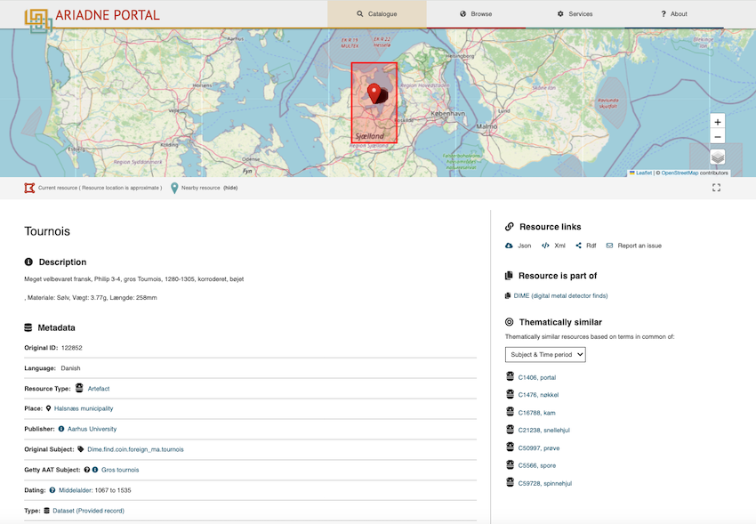
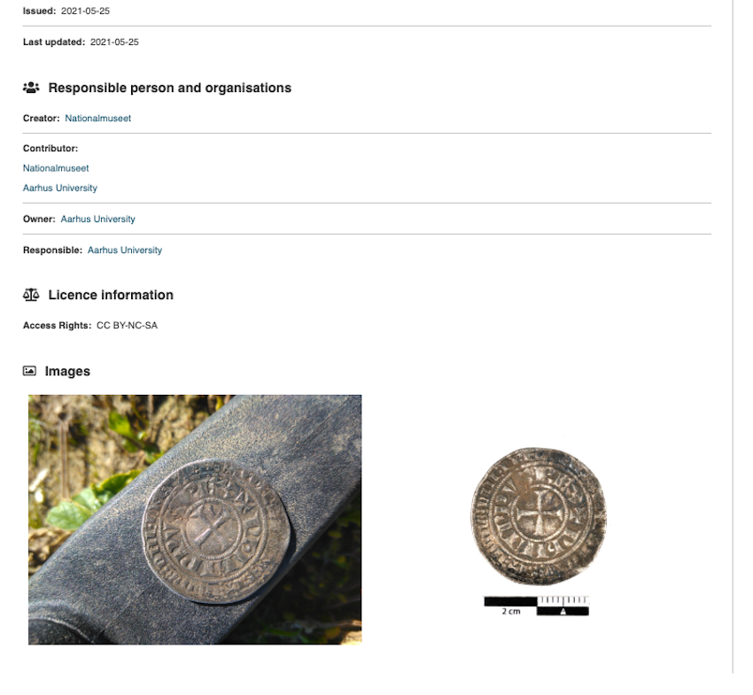

# The Resource page
Clicking on the title of a resource from the Search results page will display the metadata record and all associated information for that resource on a new web page. At the top of the page, the resource’s location is shown on a map where zoom in and out can be done using the ‘+’and ‘-‘ icons on the right hand side. The is also the option to change the layers. Below these icons there is a further rectangular icon which is a pop-up menu with options for changing the size of the dislayed map, these being small (default), medium and full screen. 

<I>Top part of the Resource page</I>

[This example](https://portal.ariadne-infrastructure.eu/resource/24d2b18c2f6c0ebe0d3ad5eb5238028efa63d8f03cdd9a7a8c210cd94ae1c1be) is from the DIME database and since it is a find, the location is shown as an approximate area where this particular coin was found. The Geo shape indicates that there is at least one other find nearby and clicking on it will display the relevant record. Multiple finds are displayed in sequence (i.e. click through one at a time) to avoid displaying multiple bounding boxes. The rest of the Resource page is shown below - this collection also has images of the finds so the resource data includes thumbnails pictures.

<I>Remaining part of the Resource page</I>

